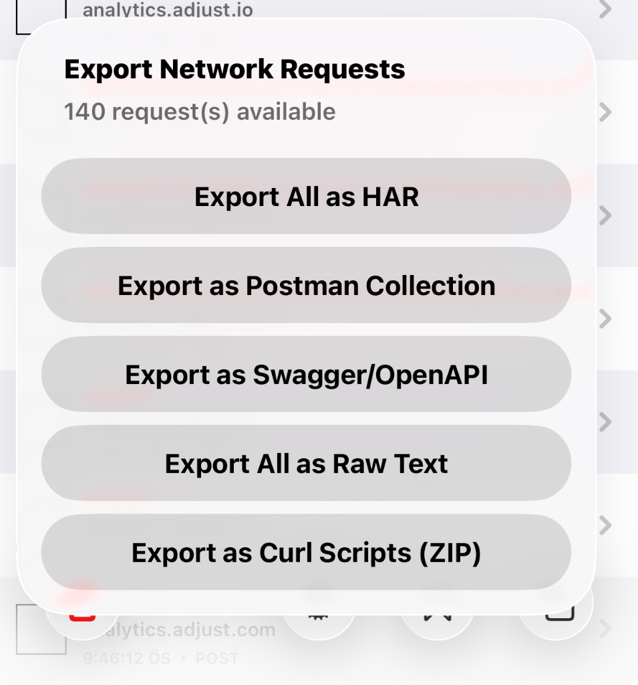

# AutoFLEX
Auto inject **Enhanced FLEX** (with Network Export) to any iOS app!

This is a modified version of FLEX that includes **Network Export** capabilities:

## Features
* **Enhanced Network Export**: Export captured requests in multiple formats (HAR, Postman, Swagger, Curl ZIP) with filters (Images, Analytics, Firebase).
* Always build with newest FLEX with Github actions
* Inject single deb into you ipa and profit
* Works even without jailbreak, and inject any 3rd party app.
* Open FLEX at application launch.

## Network Export Features
Navigate to **Network History** in FLEX to use the enhanced export capabilities:

* **Export Formats**:
    * **HAR File**: Compatible with Charles, Chrome DevTools, Proxyman
    * **Postman Collection**: Direct import for API testing
    * **Swagger/OpenAPI**: Auto-generate API documentation
    * **Curl Scripts (ZIP)**: Individual `.sh` files for each request
* **Smart Filters** (Settings → Export Filters):
    * **Exclude Images**: Skip image resources (png, jpg, svg...)
    * **Exclude Analytics**: Automatically filter 80+ tracking SDKs
    * **Exclude Firebase**: Skip analytics but keep Remote Config

## How to use with TrollFools (Easy Method)
You can easily inject AutoFLEX into any app using [TrollFools](https://github.com/Lessica/TrollFools):

1. **Install Default FLEX**:
   - Install the generated `.deb` file on your device (via Filza or dpkg).
   - Navigate to `/usr/lib/TweakInject/` using Filza.
   - Locate `autoflex.dylib`.
   - Long press -> Share -> Save to Files / iCloud.

2. **Inject with TrollFools**:
   - Open **TrollFools**.
   - Select the target app you want to debug.
   - Tap **Inject New Dylib**.
   - Select the `autoflex.dylib` you saved earlier.
   - Launch the app, and FLEX will appear!

## Install (Alternative Methods)
**Do NOT install the deb directly if you are non-jailbroken**, unless you use TrollStore/TrollFools details above.
You can also use Sideloadly or other IPA patchers to inject the `.deb` into an IPA file.

## What does it do?
It basically inject beloved FLEX debugger into any iOS application.

## How do I reopen FLEX window?
- Lock and unlock your device with the app open
- Long press status bar

## Wait, we already have FLEXList or FLEXing or blah....
Yes. yes, but first they __do not have the newest FLEX__, second they cannot be used when you have no jailbreak.

## Yes but I absolutely want to install this deb directly!
OK, you have to fork this repo, modify the autoflex.plist file to include the app bundle id you wanna hook, and run the workflow to get your deb.

## Do I need to install other FLEX library?
No, this deb is self contained, and compiled with all FLEX sources.

More details at https://hope1ess.com/2024/10/09/enhancing-ios-debugging-creating-a-custom-flex-loader-to-any-3rd-party-ios-application/
